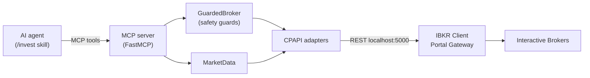

<p align="center">
  
</p>

<p align="center">
  <strong>Valet</strong> — an MCP toolkit that trades on <strong>Interactive Brokers and crypto exchanges</strong>, so your agent does the legwork and you make the call.
</p>

<p align="center">
  <a href="https://github.com/pedrobraiti/agentic-trading-mcp/actions/workflows/ci.yml"></a>
  
  
  
</p>

<p align="center">
  
</p>

**Two MCP servers over one shared safety core**, giving an AI agent (like Claude Code) the ability to trade: **`ibkr`** on **Interactive Brokers** (US stocks, **fractional shares by dollar amount** via `cashQty`) and **`crypto`** on **crypto exchanges** (spot, via CCXT — persistent API key, 24/7). Both expose quotes, balance, positions and **buy/sell** under mirrored tool names.

The investment *decision* (what/when to buy or sell) stays with you and your skill's prompt — e.g. [**Vizier**](https://github.com/pedrobraiti/vizier-trading-skill), the decision-making brain of this stack. This project delivers only the **reliable trading plumbing** — with safety guards on by default.

> ⚠️ **Not financial advice.** Runs against a *paper* account by default; *live* trading requires explicit opt-in. Use at your own risk.

> **What to expect.** The **crypto** server is the low-friction path: just a persistent API key, 24/7, no gateway — it can run unattended. The **IBKR** server needs a funded **IBKR Pro** account and a **manual browser login about once a day** (IBKR offers no OAuth for retail — an IBKR constraint, not ours), so the stock side isn't fully hands-off. First-time setup is roughly **30–60 min** per venue.

## Architecture

Hexagonal (ports & adapters). The agent talks only to the MCP tools; the safety guards sit on the path of every order; IBKR is an adapter detail:



```
src/
  trading_core/   shared core — domain models, ports, trade journal, the generic
                  GuardedBroker, and the per-venue Capabilities contract
  ibkr_agent/     IBKR adapter (cpapi/ over the Client Portal API) + the `ibkr` MCP server
  crypto_agent/   crypto adapter (adapters/ccxt/, spot) + the `crypto` MCP server
```

Each venue is a thin adapter over `trading_core`; adding a third venue is a new `*_agent`
package, not a change to the core. The diagram above shows the **IBKR** server specifically.
The reasoning behind the key choices lives in [DECISIONS.md](DECISIONS.md).

## Also trades crypto (second MCP server)

This repo is a **monorepo of two execution servers** over one shared safety core
(`trading_core`): the IBKR server above, and a **`crypto`** server (spot, via
[CCXT](https://github.com/ccxt/ccxt)). They are **separate MCP processes** — own login,
own tools, registered separately — and only share code.

Crypto is here because it removes IBKR's structural friction: a **persistent API key**
(no gateway, no daily browser login, no tickle), a **24/7** market, and CCXT behind one
interface for ~100 exchanges. The tools **mirror the IBKR names** (`session_status`,
`get_quote`, `buy`, `sell`, `close_position`, `open_orders`, …) so one skill can drive both
venues uniformly. Buy-by-value mirrors IBKR's `cashQty` via CCXT's
`createMarketBuyOrderWithCost`. **Spot-only** by default.

```bash
# register the crypto server (separate from ibkr)
claude mcp add crypto -- /path/to/.venv/Scripts/python.exe -m crypto_agent.server.app
python -m crypto_agent.healthcheck   # exchange, mode, balance, a quote
```

Safety mirrors the IBKR posture: **sandbox** (exchange testnet — free keys, no deposit) is
paper-first; the live and dry-run arms are **per-venue** (`CRYPTO_ALLOW_LIVE` /
`CRYPTO_DRY_RUN`, both independent of the IBKR gates — arming IBKR does not arm crypto),
while the policy limits (`MAX_ORDER_VALUE`, `MAX_DAILY_VALUE`, …) are shared. See
[ADR-014](DECISIONS.md) for the rationale and the `CRYPTO_*` keys in
[`.env.example`](.env.example).

## Why fractional matters

Most retail trading APIs force you into whole shares. This project leans on the IBKR Client Portal API's `cashQty` field, which lets you buy by **dollar amount** (e.g. "$50 of AAPL") and get a fractional position — the unlock for dollar-cost averaging, rebalancing, and small accounts. See [DECISIONS.md](DECISIONS.md) for the full rationale.

## Requirements

- **Python 3.12+**
- An **Interactive Brokers** account that is open, funded, and **IBKR Pro** (an API requirement, even to use the associated paper account).
- **Fractional permission** enabled: Client Portal → Settings → Trading → Trading Permissions → Stocks section → check **"Global (Trade in Fractions)"**.
- **IBKR Client Portal Gateway** running locally (Java 8u192+).
- **A dedicated username for the bot**: IBKR allows only **one** brokerage session per username — logging into TWS/mobile with the same user kills the gateway session.

## Installation

```bash
git clone https://github.com/pedrobraiti/agentic-trading-mcp.git
cd agentic-trading-mcp
python -m venv .venv
# Windows (PowerShell): & ".venv\Scripts\Activate.ps1"   (on a policy error: Set-ExecutionPolicy -Scope Process -ExecutionPolicy Bypass)
# Linux/macOS:          source .venv/bin/activate
pip install -e ".[dev]"
cp .env.example .env   # fill in IBKR_ACCOUNT_ID etc.
```

## Configuration (`.env`)

See `.env.example`. Main keys:

| Key | Default | Description |
|---|---|---|
| `IBKR_API_BASE_URL` | `https://localhost:5000/v1/api` | Client Portal Gateway endpoint |
| `IBKR_ACCOUNT_ID` | — | Account id (e.g. `DU1234567` in paper) |
| `IBKR_TRADING_MODE` | `paper` | A **label only** — it does *not* pick the account. Whether real money is at stake depends on which account you log the gateway into; the ground truth is IBKR's `isPaper` (see `account_type` from `session_status`). |
| `TRADING_ALLOW_LIVE` | `false` | Hard lock: `live` only trades if `true` |
| `TRADING_DRY_RUN` | `true` | Validates but **does not send** orders |
| `TRADING_ALLOW_SHORT` | `false` | Allow a SELL bigger than the held position (opening a short) |
| `MAX_ORDER_VALUE` | `100.0` | Per-order limit (USD) |
| `MAX_DAILY_VALUE` | — | Cumulative daily buy cap (empty = **no cap**; only the per-order `MAX_ORDER_VALUE` then applies). When empty **and** live trading is armed, the server logs a loud startup warning — set a number to bound cumulative daily spend. |
| `DUPLICATE_WINDOW_SECONDS` | `5` | Reject identical orders within this window (`0` = off) |

## Running

### Gateway setup

Valet talks to a local **Client Portal Gateway** — a small Java app from IBKR that bridges to your account. It's the most common place people get stuck, so:

1. Download [`clientportal.gw.zip`](https://download2.interactivebrokers.com/portal/clientportal.gw.zip) (from IBKR's [API page](https://www.interactivebrokers.com/en/trading/ib-api.php)). Requires **Java 8u192+**.
2. Unzip it somewhere outside this repo and start it:

   ```bash
   # Linux/macOS:  bin/run.sh root/conf.yaml
   # Windows:      bin\run.bat root\conf.yaml
   ```

3. Open `https://localhost:5000` and log in with 2FA. Accept the self-signed certificate warning — it's local and expected.
4. **You'll know it worked** when the page says **"Client login succeeds"** and `python -m ibkr_agent.healthcheck` shows `authenticated=True connected=True`.

Keep the gateway running while you use Valet; the session needs a fresh login about once a day (see [Keeping the session alive](#keeping-the-session-alive)). If the browser login misbehaves, see [Login troubleshooting](#login-troubleshooting).

### Register and verify

1. With the gateway running and logged in, register the MCP server with Claude Code:

   ```bash
   claude mcp add ibkr -- /path/to/.venv/Scripts/python.exe -m ibkr_agent.server.app
   ```

   (or run it directly to test: `python -m ibkr_agent.server.app`)

   The tools appear in a **new** Claude Code session.

2. **Check the connection** anytime (with the gateway logged in):

   ```bash
   python -m ibkr_agent.healthcheck   # or: ibkr-healthcheck
   ```

   Shows the server version, auth status, account flags (`supportsCashQty`/`supportsFractions`), balance and a quote.

### Keeping the session alive

The gateway session expires (without `/tickle` in ~6 min; lasts at most ~24h; daily maintenance ~01:00 drops it) — and IBKR offers **no** OAuth for retail, so reauth is always a manual browser login.

**While the MCP server is running it keeps its own session warm** — a background `/tickle` runs on the server's lifespan, so you don't need a separate process for interactive use. For when the MCP server isn't running (e.g. scheduled jobs, or just to watch the session), there's also a standalone keep-alive:

```bash
python -m ibkr_agent.keepalive   # or: ibkr-keepalive
```

Both `/tickle` every `TICKLE_INTERVAL_SECONDS` and, when the session drops, emit an **alert** (`[ALERT] Reauthentication required: ...`) telling you to log back in. When merely *connected* without a brokerage session, they try to recover on their own (no new 2FA).

### Login troubleshooting

**`https://localhost:5000` won't load at all** (`ERR_CONNECTION_REFUSED` / "connection refused") — the login page never even appears? That page only exists while the gateway is running, so this means the **gateway isn't up**. Start it (`bin\run.bat root\conf.yaml` on Windows, `bin/run.sh root/conf.yaml` on Linux/macOS) and leave that window open — if it closes, the gateway stops and the port refuses connections again. Only once the page loads do the login steps below apply.

If you log in and approve 2FA but **nothing happens** — the page just sits there and the API stays `authenticated:false`/`connected:false` (sometimes `ssodh/init` returns HTTP 500 / `no bridge`):

- **Restart the gateway clean and log in fresh** — this is what fixes it almost every time. Kill the Java process, start it again, reload `https://localhost:5000`, and log in. An incognito/private tab also helps (stale cookies).
- The login is **not sticky**: each time you need a fresh login, restart the gateway *first*, then log in — don't retry against the already-running gateway.
- **If it still persists**, log out of any other IBKR session (IBKR Mobile or Client Portal web) — only one brokerage session per username is allowed — then restart the gateway and try again.
- The old *launcher* build (2023) is **not** the problem — at runtime the gateway connects to the current backend.

## Exposed tools

`session_status`, `market_status`, `get_quote`, `get_quotes`, `account_summary`, `positions`, `portfolio`, `preview_order`, `buy`, `sell`, `close_position`, `stop_order`, `trailing_stop`, `bracket_order`, `order_status`, `wait_for_fill`, `cancel_order`, `open_orders`, `trade_history`, `reconcile_pending`.

- `get_quotes(symbols)` quotes a whole watchlist in **one** snapshot call (cheaper than one `get_quote` per symbol).
- `preview_order(symbol, side, ...)` estimates an order's **margin impact, commission and warnings** via IBKR's `whatif` — **without sending it** — so the agent can reason about cost before committing.
- `buy` takes `cash_amount` (USD, fractional via `cashQty`) **or** `quantity` (shares, fractional ok). Pass `limit_price` for a **LIMIT** order (market by default; LIMIT needs `quantity`).
- `sell` takes only `quantity` (shares, fractional ok); optional `limit_price` for a LIMIT sell. IBKR does **not** allow selling by dollar amount — `cashQty` is buy-only.
- `close_position(symbol)` closes 100% of a position by trading the exact fractional quantity.
- `stop_order(symbol, side, quantity, stop_price, limit_price?)` places a **STOP** (e.g. a stop-loss) — a market order triggered at `stop_price`, or a STOP-LIMIT if `limit_price` is given.
- `trailing_stop(symbol, side, quantity, trail_amount | trail_percent)` places a **trailing stop** — the trigger follows the price (by a US$ amount or a %), locking in gains as it moves.
- `bracket_order(symbol, quantity, take_profit, stop_loss, ...)` places an entry with attached **take-profit + stop-loss exits (OCO)** — when one exit fills the other is cancelled.
- `order_status(order_id)` reports an order's state, **filled quantity** and average price — use it after `buy`/`sell` to confirm a fill (positions lag right after a trade). `wait_for_fill(order_id, timeout_seconds)` polls until it fills (or is cancelled/rejected), so the agent doesn't orchestrate the retry itself.
- `portfolio()` returns a single snapshot: account summary + open positions + total unrealized P&L.
- `trade_history(limit)` returns the audit log of recent order attempts (buys, sells, dry-runs, blocks) — answers "what did my agent do?".
- `reconcile_pending(resolve_missing?)` reconciles **dispatched-but-unconfirmed** orders against IBKR's open orders. After a timeout/crash an order may have landed without its outcome journaled, so the safety layer blocks an identical resend until reconciled: orders found resting are marked resolved; ones not found stay blocked (resending blind could double them).

## Usage example

With the MCP registered, you talk in natural language and the agent uses the tools:

> **You:** *"Buy $50 of AAPL."*
> The agent calls `buy(symbol="AAPL", cash_amount=50)` — IBKR fills a **fractional** order (≈ 0.16 share), no need to pay for a whole share (~$300).

> **You:** *"Close my AAPL position."*
> The agent calls `close_position(symbol="AAPL")`, which reads the exact quantity and sells 100%.

Every tool returns an `{"ok": ..., "data": ...}` envelope. A real example of an executed fractional buy (validated live against an IBKR account):

```json
{
  "ok": true,
  "data": {
    "order_id": "8645012XX",
    "status": "filled",
    "symbol": "AAPL",
    "side": "BUY",
    "message": "Bought 0.0066 AAPL Market, Day"
  }
}
```

> Fractional **buys** use `cashQty` (dollar amount). Fractional **sells** are by share *quantity* — IBKR rejects `cashQty` on sells; that's why `close_position` exists, resolving the exact quantity for you.

## Safety (defaults)

- **paper** by default; **live** blocked unless `TRADING_ALLOW_LIVE=true`.
- **dry-run** on by default (no real order is sent).
- **Know which account is live.** `session_status` and `portfolio` report `account_type` (`"LIVE"`/`"PAPER"`) straight from IBKR's `isPaper` — not the `IBKR_TRADING_MODE` label, which can disagree with the account the gateway is actually logged into. A LIVE account also returns an explicit `warning`. Check it before trading: real-money and paper accounts are never told apart by the config alone.
- **The money-lock is bound to the real account, not the label.** Before sending, the guard verifies IBKR's `isPaper` and the logged-in account and **fails closed** if the configured `IBKR_ACCOUNT_ID` doesn't match, if a real-money account isn't armed with `TRADING_ALLOW_LIVE=true`, or if `IBKR_TRADING_MODE` disagrees with reality — so a mislabelled setup can't quietly trade real money.
- **No accidental shorts:** a SELL larger than the held position is blocked (unless `TRADING_ALLOW_SHORT=true`); exits are never trapped. **No inverted stops:** a stop already on the wrong side of the market (it would fire instantly) is rejected.
- **Buys** above `MAX_ORDER_VALUE` are rejected (it's a spend cap; exits — sells, closes, stop-losses — aren't value-gated, so a large position can always be closed or protected).
- Orders only during regular trading hours (RTH), accounting for **NYSE holidays** (via the `holidays` lib).
- CPAPI confirmation warnings are auto-accepted only through an allow-list; an unknown warning **blocks** the order.
- Optional **daily spend cap** (`MAX_DAILY_VALUE`) across all buys, tracked in the audit log — not just per-order. It is **off by default** (no cap): out of the box only the per-order `MAX_ORDER_VALUE` bounds spending, so many sub-cap buys are unbounded over a day. When it's off **and** live trading is armed (`TRADING_ALLOW_LIVE` / `CRYPTO_ALLOW_LIVE`), the server emits a loud startup warning — set `MAX_DAILY_VALUE` to bound cumulative daily spend.
- The audit-backed caps treat an **`inactive`** order conservatively: CPAPI uses `inactive` for both a dead order and one parked until the open (and a rejected order can arrive as `inactive` too), so it **counts toward** the daily cap and duplicate window on purpose — the fail-safe direction (it may over-block a retry, never over-spend).
- **Duplicate-order guard**: an identical order within `DUPLICATE_WINDOW_SECONDS` is rejected (protects against timeout/retry double-buys).
- Every order attempt (sent, dry-run, or blocked) is written to a local **audit log** (`logs/trades.jsonl`, gitignored).
- Optional **symbol allow/deny list** (`SYMBOL_ALLOWLIST` / `SYMBOL_DENYLIST`) restricts the universe the agent can trade.

The keep-alive can also POST to an optional **webhook** (`REAUTH_WEBHOOK_URL`, e.g. ntfy/Discord) when the session needs a fresh login — a one-way notification, no account data, no trade.

## Development

```bash
python -m pytest -q          # tests
python -m ruff check .       # lint
```

See [CONTRIBUTING.md](CONTRIBUTING.md) and [SECURITY.md](SECURITY.md).

## License

MIT.
