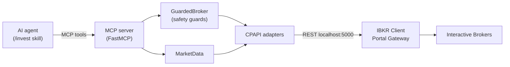

<p align="center">
  
</p>

<p align="center">
  <strong>Valet</strong> — an MCP server that trades on Interactive Brokers, so your agent does the legwork and you make the call.
</p>

<p align="center">
  <a href="https://github.com/pedrobraiti/mcp-ibkr-agent/actions/workflows/ci.yml"></a>
  
  
  
</p>

An **MCP server** that gives an AI agent (like Claude Code) the ability to trade on **Interactive Brokers**: quotes, balance, positions and orders, and **buy/sell** — including **fractional shares by dollar amount** (`cashQty`) via the Client Portal API.

The investment *decision* (what/when to buy or sell) stays with you and your skill's prompt. This project delivers only the **reliable trading plumbing** — with safety guards on by default.

> ⚠️ **Not financial advice.** Runs against a *paper* account by default; *live* trading requires explicit opt-in. Use at your own risk.

> **What to expect.** First-time setup is roughly **30–60 min**. Valet needs a funded **IBKR Pro** account and a **manual browser login about once a day** — IBKR offers no OAuth for retail, so there is no fully unattended mode (this is an IBKR constraint, not a Valet one). Once the gateway is up and logged in, your agent places orders on demand.

## Architecture

Hexagonal (ports & adapters). The agent talks only to the MCP tools; the safety guards sit on the path of every order; IBKR is an adapter detail:



```
domain/      models (OrderRequest with quantity OR cash_qty) and ports (Broker/MarketData/Auth)
adapters/    cpapi/ — implementation over the IBKR Client Portal API (REST)
safety/      GuardedBroker — guards: live lock, dry-run, value limit, trading hours
server/      MCP server (FastMCP) + dependency composition
```

Swapping/extending the broker later (e.g. an `ib_async` data adapter) means touching only `adapters/` + `server/services.py`. The reasoning behind the key choices lives in [DECISIONS.md](DECISIONS.md).

## Why fractional matters

Most retail trading APIs force you into whole shares. This project leans on the IBKR Client Portal API's `cashQty` field, which lets you buy by **dollar amount** (e.g. "$50 of AAPL") and get a fractional position — the unlock for dollar-cost averaging, rebalancing, and small accounts. See [DECISIONS.md](DECISIONS.md) for the full rationale.

## Requirements

- **Python 3.12+**
- An **Interactive Brokers** account that is open, funded, and **IBKR Pro** (an API requirement, even to use the associated paper account).
- **Fractional permission** enabled: Client Portal → Settings → Trading → Trading Permissions → Stocks section → check **"Global (Trade in Fractions)"**.
- **IBKR Client Portal Gateway** running locally (Java 8u192+).
- **A dedicated username for the bot**: IBKR allows only **one** brokerage session per username — logging into TWS/mobile with the same user kills the gateway session.

## Installation

```bash
git clone https://github.com/pedrobraiti/mcp-ibkr-agent.git
cd mcp-ibkr-agent
python -m venv .venv
# Windows (PowerShell): & ".venv\Scripts\Activate.ps1"   (on a policy error: Set-ExecutionPolicy -Scope Process -ExecutionPolicy Bypass)
# Linux/macOS:          source .venv/bin/activate
pip install -e ".[dev]"
cp .env.example .env   # fill in IBKR_ACCOUNT_ID etc.
```

## Configuration (`.env`)

See `.env.example`. Main keys:

| Key | Default | Description |
|---|---|---|
| `IBKR_API_BASE_URL` | `https://localhost:5000/v1/api` | Client Portal Gateway endpoint |
| `IBKR_ACCOUNT_ID` | — | Account id (e.g. `DU1234567` in paper) |
| `IBKR_TRADING_MODE` | `paper` | `paper` or `live` |
| `TRADING_ALLOW_LIVE` | `false` | Hard lock: `live` only trades if `true` |
| `TRADING_DRY_RUN` | `true` | Validates but **does not send** orders |
| `MAX_ORDER_VALUE` | `100.0` | Per-order limit (USD) |
| `MAX_DAILY_VALUE` | — | Cumulative daily buy cap (empty = no cap) |
| `DUPLICATE_WINDOW_SECONDS` | `5` | Reject identical orders within this window (`0` = off) |

## Running

### Gateway setup

Valet talks to a local **Client Portal Gateway** — a small Java app from IBKR that bridges to your account. It's the most common place people get stuck, so:

1. Download [`clientportal.gw.zip`](https://download2.interactivebrokers.com/portal/clientportal.gw.zip) (from IBKR's [API page](https://www.interactivebrokers.com/en/trading/ib-api.php)). Requires **Java 8u192+**.
2. Unzip it somewhere outside this repo and start it:

   ```bash
   # Linux/macOS:  bin/run.sh root/conf.yaml
   # Windows:      bin\run.bat root\conf.yaml
   ```

3. Open `https://localhost:5000` and log in with 2FA. Accept the self-signed certificate warning — it's local and expected.
4. **You'll know it worked** when the page says **"Client login succeeds"** and `python -m ibkr_agent.healthcheck` shows `authenticated=True connected=True`.

Keep the gateway running while you use Valet; the session needs a fresh login about once a day (see [Keeping the session alive](#keeping-the-session-alive)). If the browser login misbehaves, see [Login troubleshooting](#login-troubleshooting).

### Register and verify

1. With the gateway running and logged in, register the MCP server with Claude Code:

   ```bash
   claude mcp add ibkr -- /path/to/.venv/Scripts/python.exe -m ibkr_agent.server.app
   ```

   (or run it directly to test: `python -m ibkr_agent.server.app`)

   The tools appear in a **new** Claude Code session.

2. **Check the connection** anytime (with the gateway logged in):

   ```bash
   python -m ibkr_agent.healthcheck   # or: ibkr-healthcheck
   ```

   Shows the server version, auth status, account flags (`supportsCashQty`/`supportsFractions`), balance and a quote.

### Keeping the session alive

The gateway session expires (without `/tickle` in ~6 min; lasts at most ~24h; daily maintenance ~01:00 drops it) — and IBKR offers **no** OAuth for retail, so reauth is always a manual browser login. Run the keep-alive alongside manual use or scheduled jobs:

```bash
python -m ibkr_agent.keepalive   # or: ibkr-keepalive
```

It `/tickle`s every `TICKLE_INTERVAL_SECONDS` and, when the session drops, emits an **alert** (`[ALERT] Reauthentication required: ...`) telling you to log back in. When it is merely *connected* without a brokerage session, it tries to recover on its own (no new 2FA).

### Login troubleshooting

If you log in and approve 2FA but **nothing happens** — the page just sits there and the API stays `authenticated:false`/`connected:false` (sometimes `ssodh/init` returns HTTP 500 / `no bridge`):

- **Restart the gateway clean and log in fresh** — this is what fixes it almost every time. Kill the Java process, start it again, reload `https://localhost:5000`, and log in. An incognito/private tab also helps (stale cookies).
- The login is **not sticky**: each time you need a fresh login, restart the gateway *first*, then log in — don't retry against the already-running gateway.
- **If it still persists**, log out of any other IBKR session (IBKR Mobile or Client Portal web) — only one brokerage session per username is allowed — then restart the gateway and try again.
- The old *launcher* build (2023) is **not** the problem — at runtime the gateway connects to the current backend.

## Exposed tools

`session_status`, `market_status`, `get_quote`, `account_summary`, `positions`, `preview_order`, `buy`, `sell`, `close_position`, `cancel_order`, `open_orders`, `trade_history`.

- `preview_order(symbol, side, ...)` estimates an order's **margin impact, commission and warnings** via IBKR's `whatif` — **without sending it** — so the agent can reason about cost before committing.
- `buy` takes `cash_amount` (USD, fractional via `cashQty`) **or** `quantity` (shares, fractional ok).
- `sell` takes only `quantity` (shares, fractional ok). IBKR does **not** allow selling by dollar amount — `cashQty` is buy-only.
- `close_position(symbol)` closes 100% of a position by trading the exact fractional quantity.
- `trade_history(limit)` returns the audit log of recent order attempts (buys, sells, dry-runs, blocks) — answers "what did my agent do?".

## Usage example

With the MCP registered, you talk in natural language and the agent uses the tools:

> **You:** *"Buy $50 of AAPL."*
> The agent calls `buy(symbol="AAPL", cash_amount=50)` — IBKR fills a **fractional** order (≈ 0.16 share), no need to pay for a whole share (~$300).

> **You:** *"Close my AAPL position."*
> The agent calls `close_position(symbol="AAPL")`, which reads the exact quantity and sells 100%.

Every tool returns an `{"ok": ..., "data": ...}` envelope. A real example of an executed fractional buy (validated live against an IBKR account):

```json
{
  "ok": true,
  "data": {
    "order_id": "8645012XX",
    "status": "filled",
    "symbol": "AAPL",
    "side": "BUY",
    "message": "Bought 0.0066 AAPL Market, Day"
  }
}
```

> Fractional **buys** use `cashQty` (dollar amount). Fractional **sells** are by share *quantity* — IBKR rejects `cashQty` on sells; that's why `close_position` exists, resolving the exact quantity for you.

## Safety (defaults)

- **paper** by default; **live** blocked unless `TRADING_ALLOW_LIVE=true`.
- **dry-run** on by default (no real order is sent).
- Orders above `MAX_ORDER_VALUE` are rejected.
- Orders only during regular trading hours (RTH), accounting for **NYSE holidays** (via the `holidays` lib).
- CPAPI confirmation warnings are auto-accepted only through an allow-list; an unknown warning **blocks** the order.
- Optional **daily spend cap** (`MAX_DAILY_VALUE`) across all buys, tracked in the audit log — not just per-order.
- **Duplicate-order guard**: an identical order within `DUPLICATE_WINDOW_SECONDS` is rejected (protects against timeout/retry double-buys).
- Every order attempt (sent, dry-run, or blocked) is written to a local **audit log** (`logs/trades.jsonl`, gitignored).

## Development

```bash
python -m pytest -q          # tests
python -m ruff check .       # lint
```

See [CONTRIBUTING.md](CONTRIBUTING.md) and [SECURITY.md](SECURITY.md).

## License

MIT.
